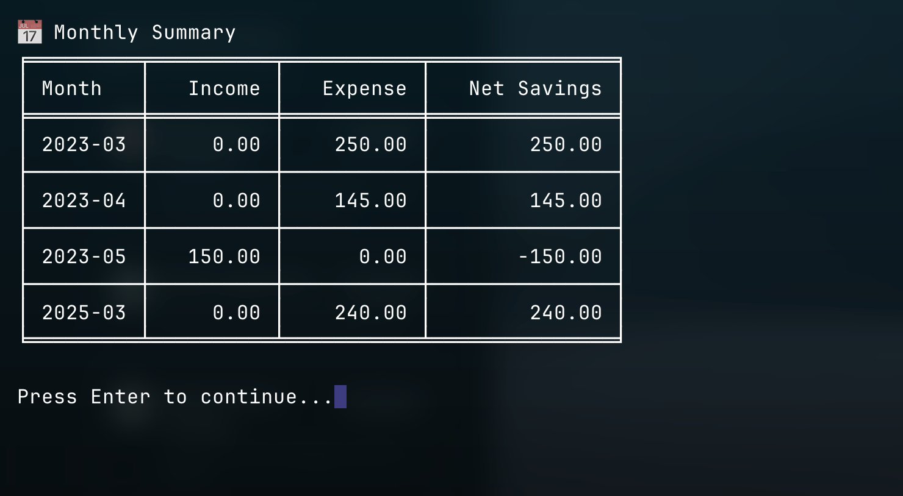
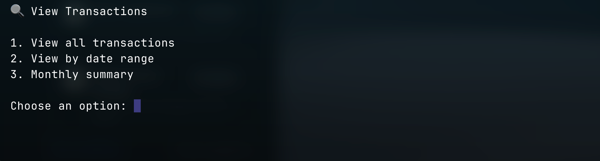

# Personal Finance Tracker

A command-line application built with Python and Pandas for managing personal finances. Track income, expenses, and generate financial reports with ease.






## Features

- 💸 **Track Transactions**: Record income and expenses with date, amount, category, and description
- 📊 **Financial Reporting**:
  - View all transactions in a formatted table
  - Filter transactions by date range
  - Generate monthly summary reports
- 🔒 **Data Safety**:
  - Automatic CSV data storage
  - Built-in backup system
  - Data validation and corruption recovery
- 📈 **Basic Financial Analytics**:
  - Total income/expense calculations
  - Net savings tracking
  - Monthly breakdowns by category
- 🖥️ **User-Friendly Interface**:
  - Clean terminal-based UI
  - Input validation and error handling
  - Cross-platform compatibility

## Installation

1. **Clone the repository**:
```bash 
git clone https://github.com/yourusername/finance-tracker.git 
cd finance-tracker
```

2. **Install Required Libraries**:
```
pip install -r requirements.txt
```

3. **Run the program**:
```
python main.py
```
